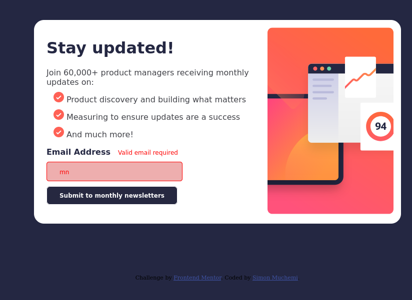

# Frontend Mentor - Newsletter sign-up form with success message solution

This is a solution to the [Newsletter sign-up form with success message challenge on Frontend Mentor](https://www.frontendmentor.io/challenges/newsletter-signup-form-with-success-message-3FC1AZbNrv). Frontend Mentor challenges help you improve your coding skills by building realistic projects. 

## Table of contents

- [Overview](#overview)
  - [The challenge](#the-challenge)
  - [Screenshot](#screenshot)
  - [Links](#links)
- [My process](#my-process)
  - [Built with](#built-with)
  - [What I learned](#what-i-learned)
  - [Continued development](#continued-development)
  - [Useful resources](#useful-resources)
- [Author](#author)
- [Acknowledgments](#acknowledgments)

**Note: Delete this note and update the table of contents based on what sections you keep.**

## Overview

### The challenge

Users should be able to:

- Add their email and submit the form
- See a success message with their email after successfully submitting the form
- See form validation messages if:
  - The field is left empty
  - The email address is not formatted correctly
- View the optimal layout for the interface depending on their device's screen size
- See hover and focus states for all interactive elements on the page

### Screenshot
- desktop

- error-state

- Mobile
- 
### Links

- [Solution](https://github.com/Simon-Muchemi/newsletter-with-success-message.git)
- [Live site URL](https://newsletter-with-success-message.vercel.app/?email=simonkenya846%40gmail.com)

## My process

### Built with

- Semantic HTML5 markup
- CSS custom properties
- Flexbox
- CSS Grid
- Mobile-first workflow

### What I learned
I learnt how to use media queries and flex-box. I also learnt how to change pages using JS.

- css media queries:
```css
@media only screen and  (max-width: 600px){
    body{
      // code
        }
```
- Flex-box:
```css
.container {
        flex-direction: column-reverse;
        width: fit-content;
    }
```
- Using js to change pages
```javascript
window.location.href = 'success-message.html';
```
### Continued development
I would like to work on my css units(relative and absolute units) as well as css grid and flex displays.

### Useful resources

- [Kevin powell's videos](https://www.youtube.com/@KevinPowell) - His videos have een of great help to me in my frontend journey

## Author

- Website - [Simon Muchemi](https://github.com/Simon-Muchemi)
- Frontend Mentor - [@Simon-Muchemi](https://www.frontendmentor.io/profile/yourusername)
- Twitter - [@SymonMuchemi](https://www.twitter.com/SymonMuchemi)

## Acknowledgments
I would like to appreciate the following for their support in helping me debug and come up with the solution for this
[task](https://www.frontendmentor.io/challenges/newsletter-signup-form-with-success-message-3FC1AZbNrv/hub):
1. [Ractified](https://www.frontendmentor.io/profile/Ratified)
2. [Mark Gatere](https://github.com/gateremark)
3. [Emilio Kariuki](https://github.com/emilio-kariuki)